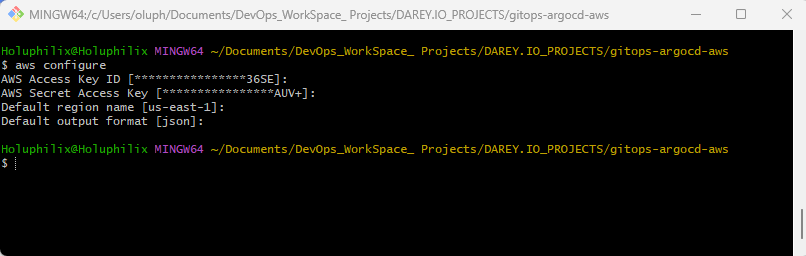
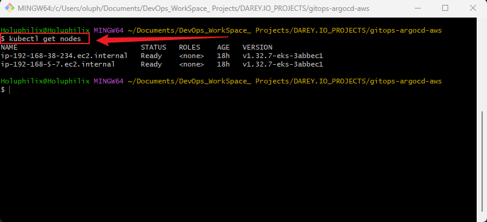
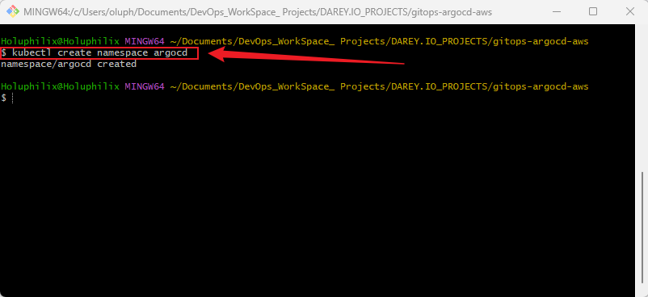
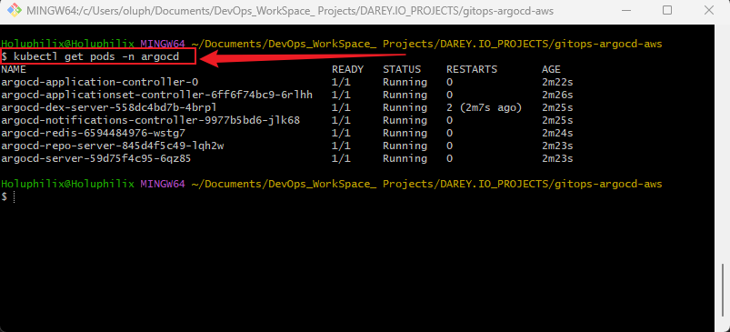
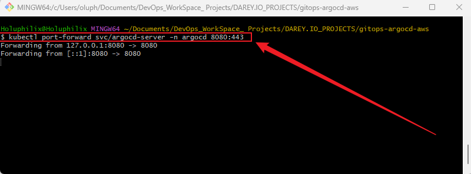
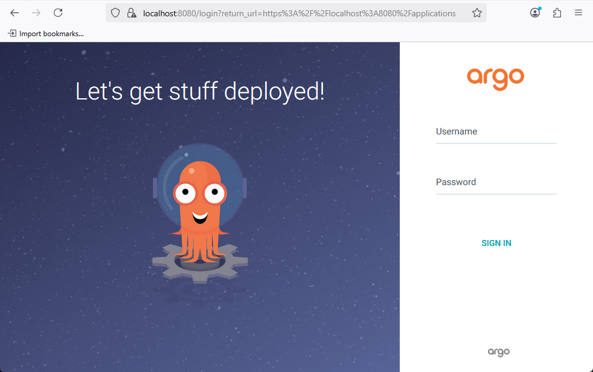
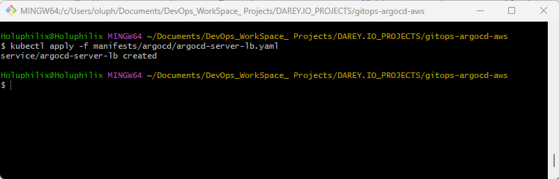
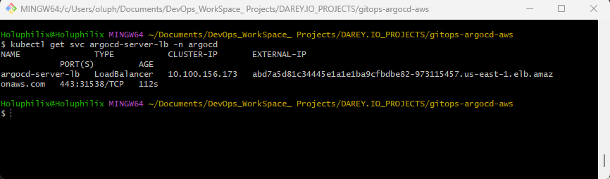
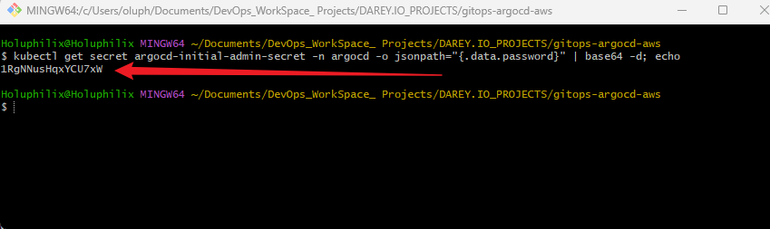

# **Introduction to GitOps and ArgoCD using AWS**

## **Project Overview**

This project introduces learners to the principles of **GitOps** and its implementation using **ArgoCD** on **Amazon EKS (Elastic Kubernetes Service)**. It focuses on deploying applications declaratively, ensuring consistency between Git repositories (desired state) and Kubernetes clusters (live state).

Learners will gain hands-on experience in setting up ArgoCD, exploring its architecture, and managing deployments using GitOps workflows.

## **Why is this Project Relevant?**

As organizations move toward cloud-native technologies, the need for **automated, reliable, and scalable deployment strategies** is increasing. GitOps with ArgoCD provides a powerful solution by:

* Enforcing **Infrastructure as Code (IaC)**.
* Ensuring **self-healing deployments**.
* Offering **traceable change management**.
* Managing **multi-environment and multi-cluster deployments** with ease.

This project equips learners with essential **DevOps and cloud-native skills** that are highly in demand across the tech industry.

## **Project Goals and Objectives**

* Understand GitOps principles and benefits.
* Install and configure ArgoCD in an AWS-hosted Kubernetes environment (Amazon EKS).
* Explore ArgoCD’s architecture and key components.
* Deploy and synchronize applications using GitOps workflows.
* Gain practical experience with cloud-native DevOps best practices.

## **Prerequisites**

1. Basic understanding of Kubernetes (pods, deployments, services).
2. An active AWS account.
3. Running Amazon EKS cluster.
4. Installed tools:

   * **kubectl**
   * **AWS CLI**
   * **Git**
   * **Text Editor/IDE (e.g., VSCode)**
5. Optional but recommended:

   * **Docker**
   * **Helm**
   * **Kustomize**


## **Project Deliverables**

* A GitOps-enabled **EKS cluster** with ArgoCD installed.
* Documentation and architecture explanation.
* Sample application deployed using ArgoCD.
* Step-by-step project README.md with screenshots and commands.

## **Tools & Technologies Used**

* **AWS (Amazon Web Services)** – for hosting the Kubernetes cluster (EKS).
* **Kubernetes** – container orchestration.
* **ArgoCD** – GitOps continuous delivery tool.
* **Git** – version control system.
* **kubectl** – Kubernetes command-line tool.
* **AWS CLI** – AWS resource management.
* **VSCode** – code editor.
* **Docker** (optional).
* **Helm & Kustomize** (optional).

## **Project Components**

* **Amazon EKS Cluster** (Kubernetes environment).
* **ArgoCD** (GitOps operator).
* **Git Repository** (source of truth for deployments).
* **Sample Application** (to demonstrate synchronization).
* **Documentation (README.md)**.

Perfect 👍 I see what you mean — you want **Task numbering (`##`)** and **Step numbering (`###`)** to be consistent across both Task 1 and Task 2. Let me align and restructure everything cleanly for you:

## **Task 1: Project Directory and Structure**

The first step is to create the main project directory with all the necessary sub-directories and files. This ensures we maintain a clean and organized workflow throughout the project.

### **Step 1: Commands to Create Project Structure**

Run the following commands in your terminal:

```bash
# Create main project directory
mkdir gitops-argocd-aws && cd gitops-argocd-aws

# Create sub-directories
mkdir -p manifests/app manifests/argocd
mkdir images

# Create README.md file
touch README.md
```

### **Step 2: Explanation of Structure**

* **README.md** → This will serve as the main documentation file containing all steps, explanations, and usage instructions.
* **manifests/** → This folder will hold all Kubernetes YAML manifests.

  * **app/** → Contains manifests for deploying a sample application.
  * **argocd/** → Contains manifests related to ArgoCD installation and configuration.
* **images/** → Used to store screenshots and diagrams that will be referenced in the README.

### **Step 3: Directory Structure**

```bash
gitops-argocd-aws/
├── README.md                # Main project documentation
├── manifests/               # Kubernetes manifests
│   ├── app/                 # Sample application manifests
│   └── argocd/              # ArgoCD installation & config manifests
└── images/                  # Screenshots and diagrams
```

### **Task 1 Completion Note**

✔️ Task 1 Completed – Project directory and sub-directory structure are successfully created and organized.

## **Task 2: Installing and Configuring ArgoCD on Amazon EKS**

This task sets up ArgoCD inside your Amazon EKS cluster. ArgoCD will serve as the GitOps operator, synchronizing Kubernetes manifests stored in Git with the live cluster.

### **Step 1: Set Up eksctl on Windows**

#### 1. Install `eksctl`

1. Download the latest Windows release: 👉 [eksctl releases](https://github.com/eksctl-io/eksctl/releases/latest)
2. Extract **`eksctl.exe`**.
3. Move it to a directory in your **PATH** (e.g., `C:\Program Files\eksctl\`).
4. Add the path to **System Environment Variables → Path**.
5. Verify installation:

   ```powershell
   eksctl version
   ```

#### 2. Install `kubectl`

1. Download from official docs: 👉 [Install kubectl on Windows](https://kubernetes.io/docs/tasks/tools/install-kubectl-windows/)
2. Add it to PATH.
3. Verify:

   ```powershell
   kubectl version --client
   ```

#### 3. Install AWS CLI

1. Download: 👉 [AWS CLI installer](https://aws.amazon.com/cli/)
2. Install and verify:

   ```powershell
   aws --version
   ```
3. Configure credentials:

   ```powershell
   aws configure
   ```

   Enter:

   * AWS Access Key ID
   * AWS Secret Access Key
   * Default region (e.g., `us-east-1`)
   * Output format (json)

**Screenshot:** aws configure


#### 4. Create an EKS Cluster

Example cluster creation command:

```powershell
eksctl create cluster \
  --name gitops-eks-cluster \
  --region us-east-1 \
  --nodes 2 \
  --node-type t3.medium \
  --nodes-min 1 \
  --nodes-max 3 \
  --managed
```

📌 This takes \~10–15 minutes.

Verify cluster:

```powershell
kubectl get nodes
```

**Screenshot:** kubectl get nodes


### **Step 2: Create Namespace for ArgoCD**

Run:

```powershell
kubectl create namespace argocd
```

**Screenshot:** kubectl create namespace argocd


### **Step 3: Install ArgoCD**

Apply the official installation manifests:

```powershell
kubectl apply -n argocd -f https://raw.githubusercontent.com/argoproj/argo-cd/stable/manifests/install.yaml
```

### **Step 4: Verify Installation**

Check pods:

```powershell
kubectl get pods -n argocd
```

**Screenshot:** kubectl get pods -n argocd



### **Step 5: Access ArgoCD UI**

#### Option 1: Port Forward (local access)

```powershell
kubectl port-forward svc/argocd-server -n argocd 8080:443
```

**Screenshot:** kubectl port-forward


Open in browser: 👉 [https://localhost:8080](https://localhost:8080)

**Screenshot:** Localhost


#### Option 2: Expose via LoadBalancer (cloud access)

Create `manifests/argocd/argocd-server-lb.yaml`:

```yaml
apiVersion: v1
kind: Service
metadata:
  name: argocd-server-lb
  namespace: argocd
spec:
  type: LoadBalancer
  ports:
    - name: https
      port: 443
      targetPort: 8080
  selector:
    app.kubernetes.io/name: argocd-server
```

Apply it:

```powershell
kubectl apply -f manifests/argocd/argocd-server-lb.yaml
```

**Screenshot:** Kubectl apply manifests


Get external IP:

```powershell
kubectl get svc argocd-server-lb -n argocd
```

**Screenshot:** kubectl get svc argocd-server-lb -n argocd


Access in browser:
👉 `https://abd7a5d81c34445e1a1e1ba9cfbdbe82-973115457.us-east-1.elb.amazonaws.com`

### **Step 6: Login to ArgoCD**

Retrieve the initial admin password:

```powershell
kubectl get secret argocd-initial-admin-secret -n argocd -o jsonpath="{.data.password}" | base64 -d; echo
```

Login via CLI:

```powershell
argocd login abd7a5d81c34445e1a1e1ba9cfbdbe82-973115457.us-east-1.elb.amazonaws.com
```

Login via UI:

* Username: `admin`
* Password: (retrieved above)

**Screenshot:** admin password



### **Task 2 Completion Note**

✔️ Task 2 Completed – ArgoCD is successfully installed and accessible via UI and CLI on the EKS cluster.

## **Task 3: Deploying a Sample Application with ArgoCD**

This task demonstrates how to deploy a Kubernetes application using ArgoCD. The purpose is to show GitOps in action, where the desired state of an application is stored in Git and automatically synchronized to your EKS cluster.

### **Step 1: Project Directory Structure**

After Task 3 additions, your project directory should look like this:

```bash
gitops-argocd-aws/
├── README.md                # Main project documentation
├── manifests/               # Kubernetes manifests
│   ├── app/                 # Sample application manifests
│   │   ├── nginx-deployment.yaml
│   │   └── nginx-service.yaml
│   └── argocd/              # ArgoCD installation & config manifests
│       └── nginx-app.yaml   # ArgoCD Application manifest for Nginx
└── images/                  # Screenshots and diagrams
    ├── 1.aws_configure.png
    ├── 2.kubectl_get_nodes.png
    ├── 3.kubectl_create_namespace_argocd.png
    ├── 4.kubectl_get_pods_n_argocd.png
    ├── 5.kubectl_port-forward_svc_argocd.png
    ├── 6.localhost.png
    ├── 7.kubectl_apply_manifests.png
    ├── 9.kubectl_get_svc_argocd.png
    ├── 10.argocd_password.png
    ├── 11.argocd_app_nginx.png
    └── 12.nginx_localhost.png
```

### **Step 2: Prepare Sample Application Manifests**

Create a simple Nginx deployment and service. Save the following files under `manifests/app/`.

#### `manifests/app/nginx-deployment.yaml`

```yaml
apiVersion: apps/v1
kind: Deployment
metadata:
  name: nginx-deployment
  labels:
    app: nginx
spec:
  replicas: 2
  selector:
    matchLabels:
      app: nginx
  template:
    metadata:
      labels:
        app: nginx
    spec:
      containers:
      - name: nginx
        image: nginx:stable
        ports:
        - containerPort: 80
```

#### `manifests/app/nginx-service.yaml`

```yaml
apiVersion: v1
kind: Service
metadata:
  name: nginx-service
spec:
  type: ClusterIP
  selector:
    app: nginx
  ports:
    - port: 80
      targetPort: 80
```

### **Step 3: Push Project to GitHub**

Before applying the ArgoCD Application manifest, push your project to GitHub so ArgoCD can sync the application.

#### **1. Initialize Git Repository**

```bash
git init
```

#### **2. Add Files to Staging**

```bash
git add .
```

#### **3. Commit Changes**

```bash
git commit -m "Initial commit: Add project structure and sample application manifests"
```

#### **4. Add Remote Repository**

```bash
git remote add origin https://github.com/<YOUR_GITHUB_USERNAME>/gitops-argocd-aws.git
```

#### **5. Push to GitHub**

```bash
git branch -M main
git push -u origin main
```

**Screenshot Example:** GitHub push


### **Step 4: Create an ArgoCD Application**

ArgoCD uses a declarative Application manifest to deploy resources from Git to the cluster.

Create `manifests/argocd/nginx-app.yaml`:

```yaml
apiVersion: argoproj.io/v1alpha1
kind: Application
metadata:
  name: nginx-app
  namespace: argocd
spec:
  project: default
  source:
    repoURL: 'https://github.com/<YOUR_GITHUB_USERNAME>/gitops-argocd-aws.git'
    targetRevision: main
    path: manifests/app
  destination:
    server: 'https://kubernetes.default.svc'
    namespace: default
  syncPolicy:
    automated:
      prune: true
      selfHeal: true
```

### **Step 5: Apply the Application Manifest**

Deploy the ArgoCD Application:

```powershell
kubectl apply -f manifests/argocd/nginx-app.yaml
```

### **Step 6: Verify Application Deployment**

Check the application status via CLI:

```powershell
argocd app list
argocd app get nginx-app
```

Check Kubernetes resources:

```powershell
kubectl get deployments
kubectl get svc
```

**Screenshot Example:** Application deployed successfully


### **Step 7: Access the Sample Application**

1. Port forward the service to your local machine:

```powershell
kubectl port-forward svc/nginx-service 8080:80
```

2. Open your browser and access:
   👉 [http://localhost:8080](http://localhost:8080)

You should see the default Nginx welcome page.

**Screenshot:** Nginx Application


✅ **Task 3 Completed** – A sample Nginx application is now deployed and accessible using ArgoCD on EKS. The project has been pushed to GitHub, enabling full GitOps workflow.
